

# Mahedhi Hassan Fahim

### Embedded Electronics & Hardware Design Engineer
### PCB, High-Speed PCB Design, Mixed-Signal PCB Design, Embedded Systems

Incheon, South Korea, International work experience — Malaysia, South Korea

---

## Table of Contents

- [About](#-about)
- [Technical Stack](#-technical-stack)
- [Hardware Engineering Expertise](#-hardware-engineering-expertise)
- [Tools & Software](#-tools--software)
- [Management & Collaboration](#-management--collaboration)
- [Design Standards & Compliance](#-design-standards--compliance-competencies)
- [Featured Projects](#-featured-projects)
- [Experience Certificates](#-experience-certificates)
- [Education](#-education)
- [Research & Publications](#-research--publications)
- [Awards & Achievements](#-awards--achievements)
- [Professional Experience](#-professional-experience-summary)
- [Contact](#-get-in-touch)

---

## About

Embedded hardware and PCB design engineer with **over 5 years of experience** delivering reliable, high-performance electronic products across industrial, IoT, automotive, and consumer markets.

I specialise in **multi-layer and HDI PCB design**, **microprocessor-based System-on-Module (SOM) development**, **high-speed and mixed-signal PCB design**, **power electronics**, and **signal/power integrity**. I take products end-to-end — from concept and schematic capture, through layout and simulation, to **high-speed and mixed-signal testing in the lab**, **prototype bring-up**, and **production support** — while leading design teams and collaborating cross-functionally with QA, QC, and manufacturing.

> **Currently open to new opportunities in hardware design, embedded systems, and PCB engineering.**

---

## Hardware Engineering Expertise

| Domain | Detailed Skills |
|---|---|
| **Analog Hardware** | Analog sensors, OP-AMPs, audio amplifiers, audio codecs, BLDC motor drivers, MEMS microphones |
| **Digital Hardware** | MCUs (STM32, ESP32, AVR, PIC), SoCs & microprocessors (Rockchip RK3588, Hailo-8, Allwinner, NXP i.MX8M Plus, Qualcomm IPQ5018), DDR/LPDDR, eMMC, MIPI, HDMI, USB, PCIe, LVDS, CMOS gate drivers, totem-pole drivers |
| **Power Electronics** | AC-DC (LLC and flyback converters), DC-DC (buck, boost, buck-boost, LDO), DC-AC (inverters), SMPS design |
| **Communication Protocols** | UART, I2C, I2S, SPI, CAN bus, RS-485, RS-422, RS-232, TWI, MIPI |
| **PCB Design Technique** | HDI layout, stack-up design, impedance matching, length matching, signal integrity, power integrity, EMC / EMI mitigation |
| **Lab Equipment** | Oscilloscopes, vector analyzers, power supplies, function generators, multimeters |

---

## Tools & Software

| Category | Tools |
|---|---|
| **ECAD Tools** | OrCAD X / Allegro X, Altium Designer, KiCAD |
| **Simulation Tools** | Cadence Sigrity Aurora, LTspice, TINA-TI, OrCAD PSpice |
| **Programming** | Embedded C, C++, Python *— intermediate level, used for device bring-up only* |
| **Management Software** | JIRA, Microsoft Office |

---

## Management & Collaboration

| Domain | Details |
|---|---|
| **Team Management** | Team management, cross-functional collaboration (QA, QC, production, process improvement) |

---

## Design Standards & Compliance Competencies

Across the projects below, I have hands-on experience designing for the following standards and compliance criteria:

| Category | Standards / Competencies |
|---|---|
| **EMC / EMI** | Layout-level EMI mitigation, filtering, shielding, return-path management |
| **ESD Protection** | TVS diodes, ESD-aware layout, IEC 61000-4-2 |
| **Regulatory** | FCC, CE, IEC 61000-4-2 |
| **Signal Integrity** | Crosstalk, coupling, reflection analysis; impedance control; length matching |
| **Power Integrity** | IR drop analysis, decoupling strategy, PDN design |
| **High-Speed PCB** | HDI stack-up, controlled impedance, differential routing |
| **Memory Routing** | DDR4 / LPDDR4 fly-by topology, write-leveling, length and skew control |
| **High-Speed Buses** | USB 3.0 differential pair routing, PCIe lane routing |
| **Networking** | Ethernet RGMII routing, magnetics integration |
| **RF Design** | RF module integration, antenna routing, controlled-impedance RF traces |
| **Manufacturability** | IPC-2221, IPC-2152, IPC-A-600, IPC-A-610 compliance |

---

## Featured Silicon & Processors

---

## Featured Projects

> **Note:** Each project below covers the description, key features, and a checklist of design standards & compliance areas the board was engineered against.

### 01. FALCON — i.MX8M System-on-Module (SODIMM Form Factor)
> **Falcon S1** — High-Performance AI Edge Computing SBC.

**Category:** *Embedded Computing & Edge AI*
**Role:** *Senior Electronics Design Engineer, Elliance Sdn Bhd, Malaysia*

<table>
<tr><td width="50%">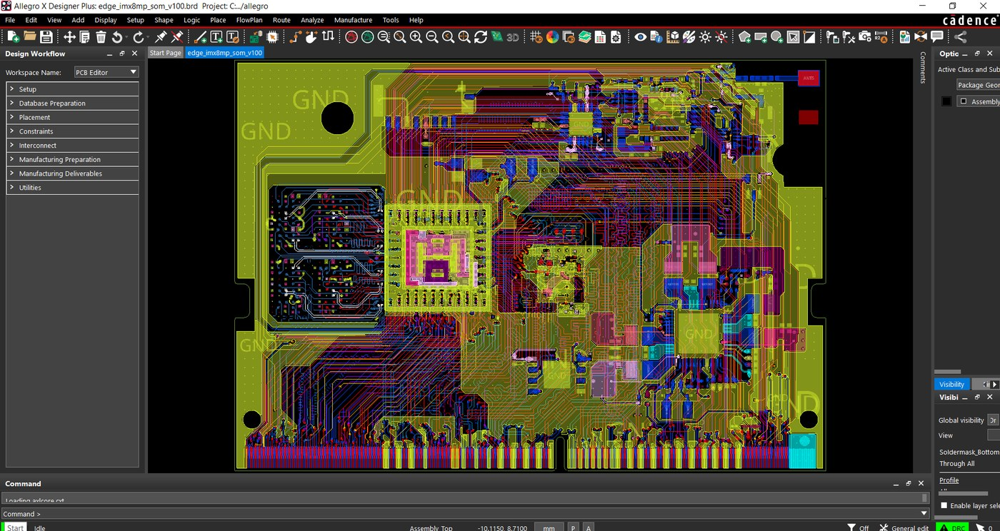</td><td width="50%">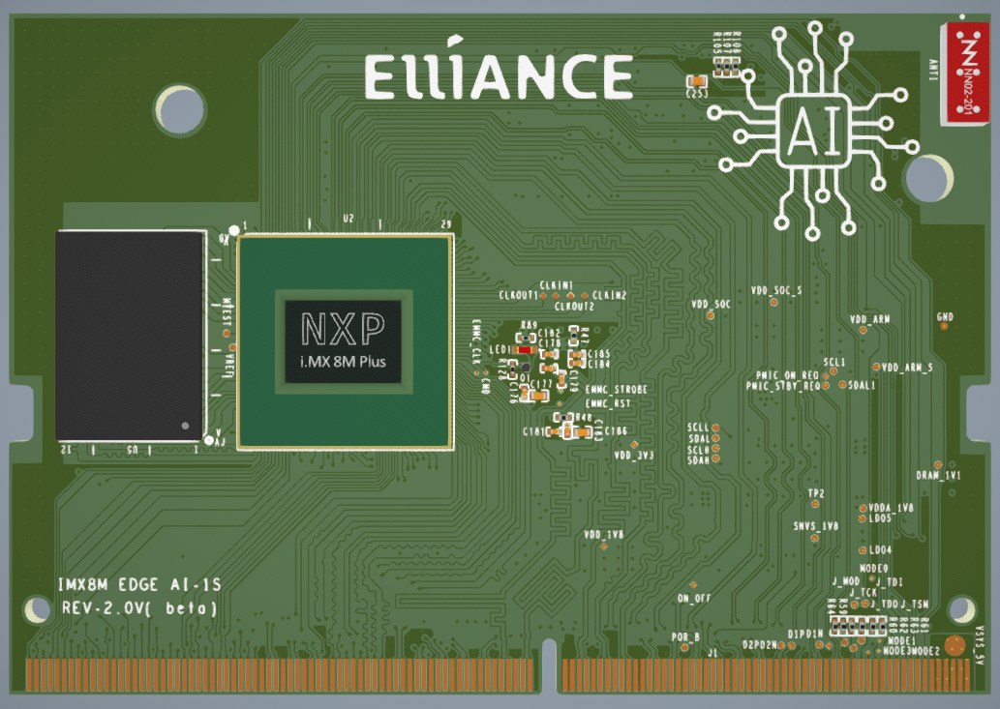</td></tr>
<tr><td width="50%">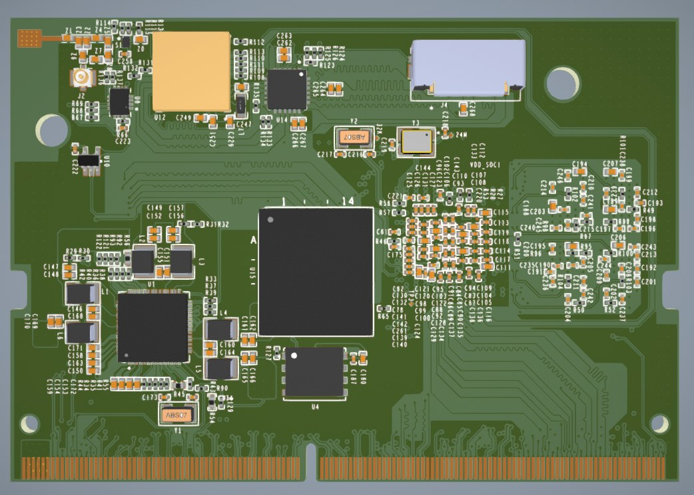</td><td width="50%">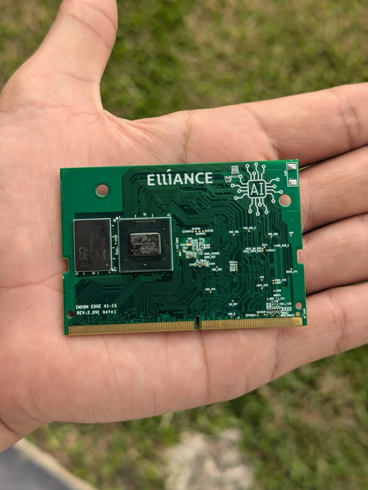</td></tr>
<tr><td colspan="2">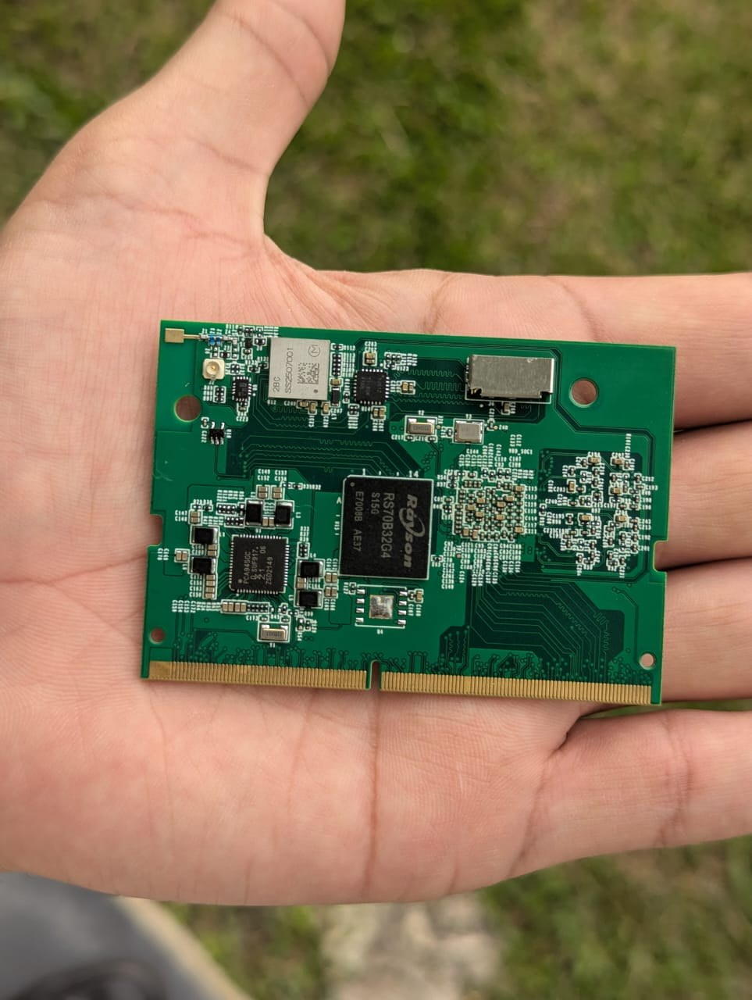</td></tr>
</table>

#### Project Description

Designed and developed a high-performance Single Board Computer (SBC) based on the **NXP i.MX 8M Plus** processor for AI, industrial automation, machine vision, robotics, and edge computing applications.

The SODIMM connector exposes essential high-speed and low-speed interfaces, enabling the development of application-specific carrier boards for industrial control, AI edge computing, smart agriculture, robotics, IoT gateways, and embedded vision systems.

**Key Features**

- 8 GB LPDDR4X RAM
- 128 GB eMMC flash storage
- Integrated Wi-Fi and Bluetooth Low Energy (BLE) module
- Dual wireless connectivity — onboard PCB antenna and external antenna support
- High-speed SODIMM expansion interface for carrier-board development
- MIPI-CSI camera interfaces for machine vision and imaging applications
- MIPI-DSI display interface for LCD and HMI solutions
- Gigabit Ethernet (RGMII) support
- USB high-speed interfaces
- HDMI display output
- Multiple UART interfaces for serial communication
- I²C and SPI interfaces for peripheral expansion
- General-Purpose Input/Output (GPIO) expansion capability

#### Design Standards & Compliance
- **High-Speed PCB Design** — HDI stack-up, controlled impedance
- **LPDDR4X Routing** — fly-by topology, length & skew matching, write-leveling
- **Signal Integrity** — crosstalk, coupling, reflection (Sigrity Aurora simulation)
- **Power Integrity** — IR-drop analysis, PDN decoupling
- **High-Speed Interfaces** — MIPI-CSI / MIPI-DSI / HDMI / USB differential pair routing
- **Ethernet RGMII** — clock-skew control, magnetics integration
- **RF Integration** — onboard Wi-Fi/BLE module, PCB antenna routing, external-antenna RF path
- **EMC / EMI** — return-path management, RF shielding considerations
- **IPC Standards** — IPC-2221, IPC-A-600

---

### 02. FALCON S1 — Industrial Carrier Board
> Industrial-grade carrier platform for the Falcon S1 SoM.

**Category:** *Embedded Computing & Edge AI*
**Role:** *Senior Electronics Design Engineer, Elliance Sdn Bhd, Malaysia*

<table>
<tr><td width="50%">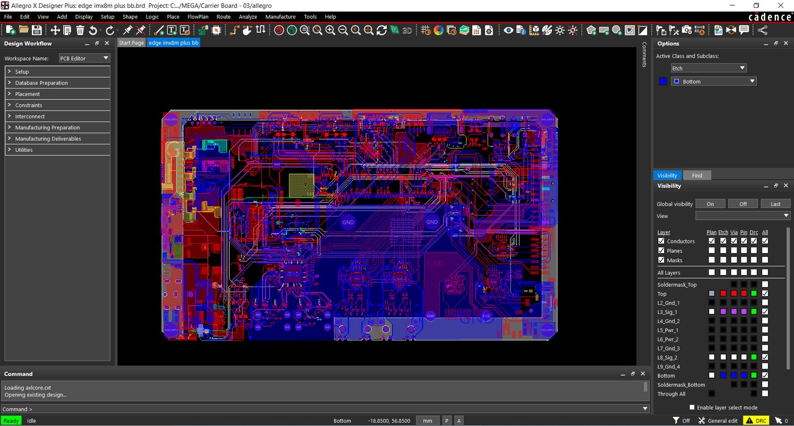</td><td width="50%">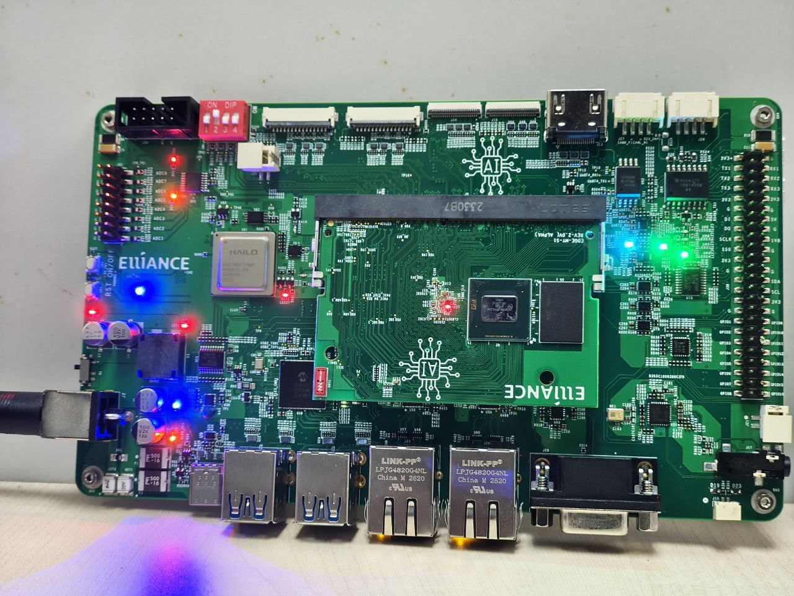</td></tr>
</table>

#### Project Description

Designed and developed an industrial-grade carrier board for the **Falcon S1 System-on-Module (SoM)**, providing extensive connectivity and expansion capabilities for industrial automation, machine vision, edge AI, robotics, and IoT applications.

**Key Features**

- 1 × HDMI display output
- Integrated audio codec with audio input / output support
- 2 × Raspberry Pi-compatible MIPI-CSI camera connectors
- 2 × LVDS display connectors
- 1 × MIPI-DSI display connector
- 4 × USB 3.0 Type-A host ports
- 1 × USB Type-C port
- 2 × Gigabit Ethernet (10 / 100 / 1000 Mbps) ports
- 1 × CAN FD interface
- 1 × RS-232 serial interface
- 1 × RS-485 industrial communication interface
- 2 × UART expansion connectors
- 8 × 12-bit ADC input channels
- 16 × GPIO expansion signals
- 1 × I²C expansion connector

**Applications**

The carrier board is designed to support industrial control systems, AI-powered edge computing, machine vision, smart agriculture, robotics, factory automation, smart-city infrastructure, and custom embedded solutions. The board exposes high-speed and low-speed interfaces from the Falcon S1 SoM, enabling rapid development and deployment of application-specific systems.

#### Design Standards & Compliance
- **High-Speed PCB Design** — controlled-impedance routing for SoM interfaces
- **USB 3.0 Differential Routing** — length-matched pairs, return-path integrity
- **Ethernet RGMII** — clock-skew control, magnetics integration for dual Gigabit ports
- **High-Speed Display Interfaces** — HDMI / LVDS / MIPI-DSI differential pair routing
- **CAN FD & Industrial Buses** — common-mode filtering, termination for CAN / RS-485 / RS-232
- **Mixed-Signal Layout** — 12-bit ADC isolation, analog / digital ground partitioning
- **ESD Protection** — IEC 61000-4-2 on all user-facing I/O and connectors
- **EMC / EMI** — return-path management, shielding for high-speed I/O
- **IPC Standards** — IPC-2221, IPC-A-610

---

### 03. MAPLE ROUTER — Dual-Band Industrial Wi-Fi 6 Router
> Industrial-grade Wi-Fi 6 + cellular networking platform.

**Category:** *Connectivity, RF & IoT*
**Role:** *Hardware Design Engineer*

<table>
<tr><td width="50%">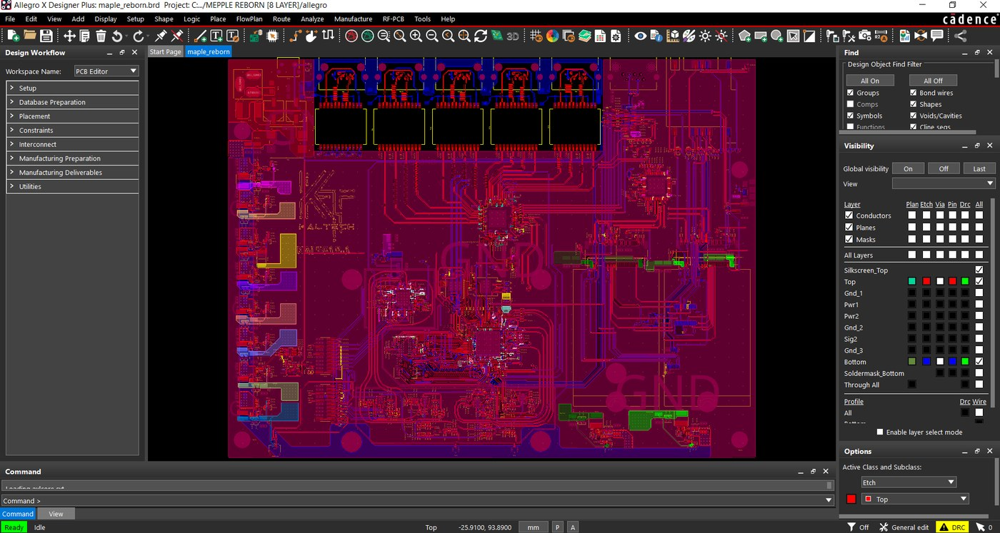</td><td width="50%">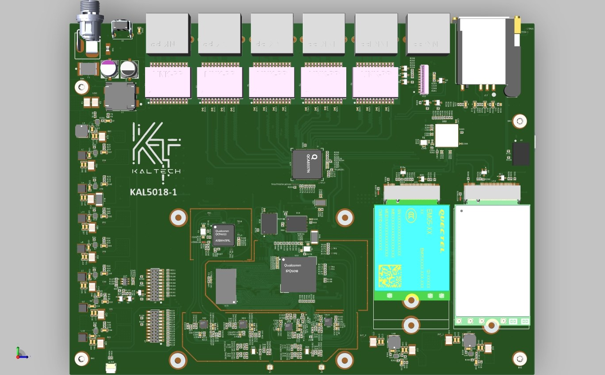</td></tr>
</table>

#### Project Description

Designed and developed an industrial-grade **dual-band Wi-Fi 6 router** based on Qualcomm networking platforms, targeting enterprise networking, industrial IoT, smart factories, smart cities, and edge connectivity applications.

**Key Features**

- Qualcomm IPQ5018 SoC-based networking platform
- Dual-band Wi-Fi 6 (802.11ax) support
- 2.4 GHz Wi-Fi radio powered by Qualcomm IPQ5018
- 5 GHz Wi-Fi radio powered by Qualcomm QCN6122
- High-performance wireless connectivity with enhanced throughput and coverage
- QCA8337 Gigabit Ethernet switch
- 4 × Gigabit LAN ports
- Dual M.2 slots supporting LTE / 4G / 5G modem expansion
- 2 × USB interfaces for M.2 cellular modem connectivity

**Applications**

The Maple Router is designed for industrial IoT gateways, smart manufacturing, transportation systems, enterprise networking, remote monitoring, smart-city infrastructure, edge-AI deployments, and locations requiring reliable Wi-Fi and cellular network redundancy. The dual-band Wi-Fi 6 architecture and dual LTE modem capability provide high-speed, resilient, and flexible connectivity for mission-critical applications.

#### Design Standards & Compliance
- **RF Module Integration** — dual-band Wi-Fi 6 RF chains, antenna routing, matching networks
- **Cellular RF** — M.2 LTE / 4G / 5G modem integration, cellular antenna paths
- **EMC / EMI** — multi-radio coexistence, RF emissions control, shielding, filtering
- **Regulatory** — FCC and CE design considerations for Wi-Fi 6 and cellular operation
- **Ethernet RGMII** — controlled-impedance routing, clock-skew management across switch ports
- **High-Speed PCB Design** — multi-layer impedance-controlled stack-up
- **USB Differential Routing** — length-matched pairs for M.2 USB lanes
- **IPC Standards** — IPC-2221, IPC-A-600

---

### 04. OPENFLOPPY — FPGA-Based DSP and Embedded Processing System
> Programmable DSP platform with FPGA, Wi-Fi, audio codec, and high-speed storage.

**Category:** *Embedded Computing & Edge AI*
**Role:** *Hardware Design Engineer*

<table>
<tr><td width="50%">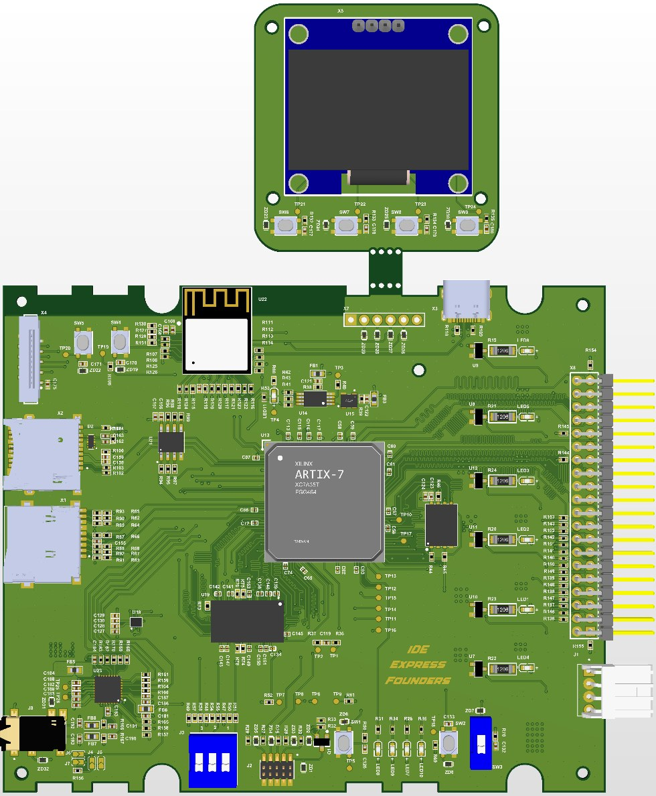</td><td width="50%">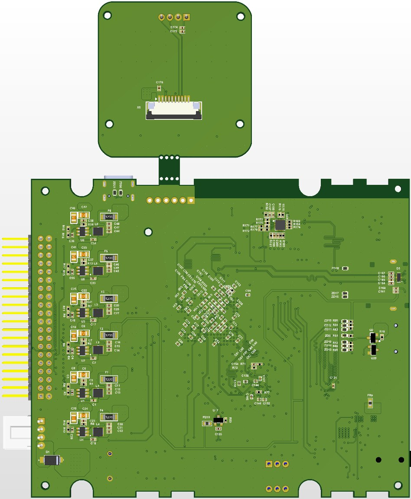</td></tr>
<tr><td colspan="2" align="center">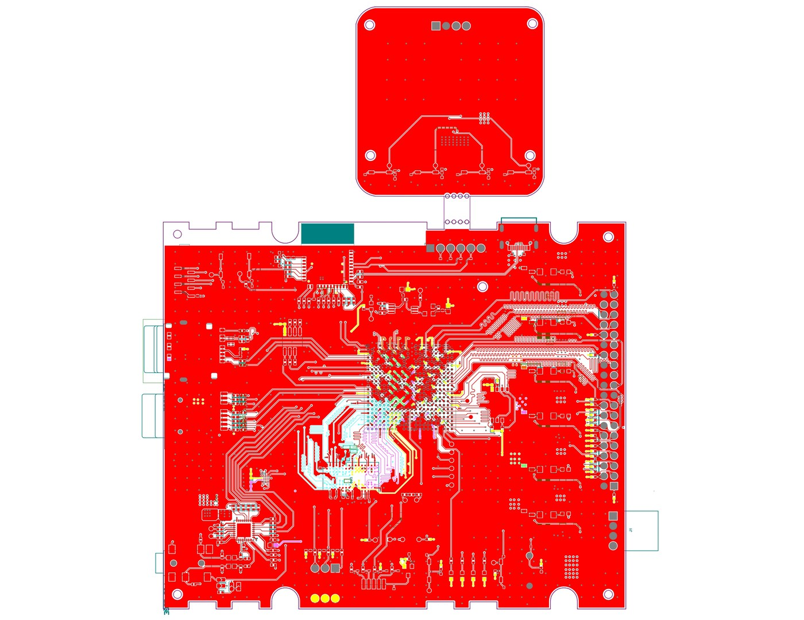</td></tr>
<tr><td width="50%">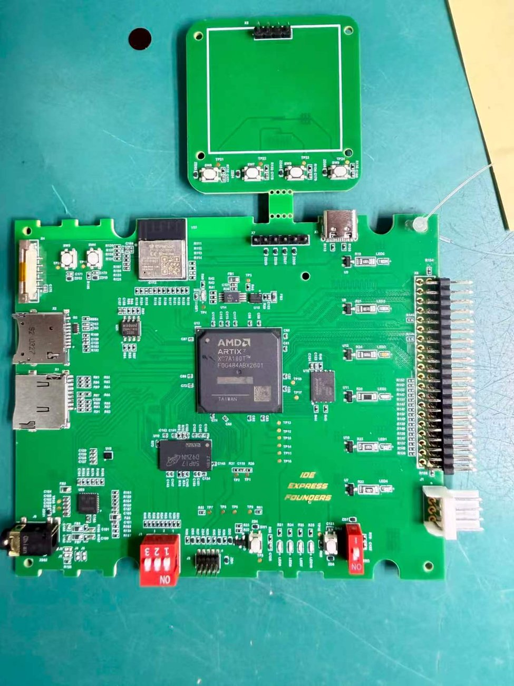</td><td width="50%">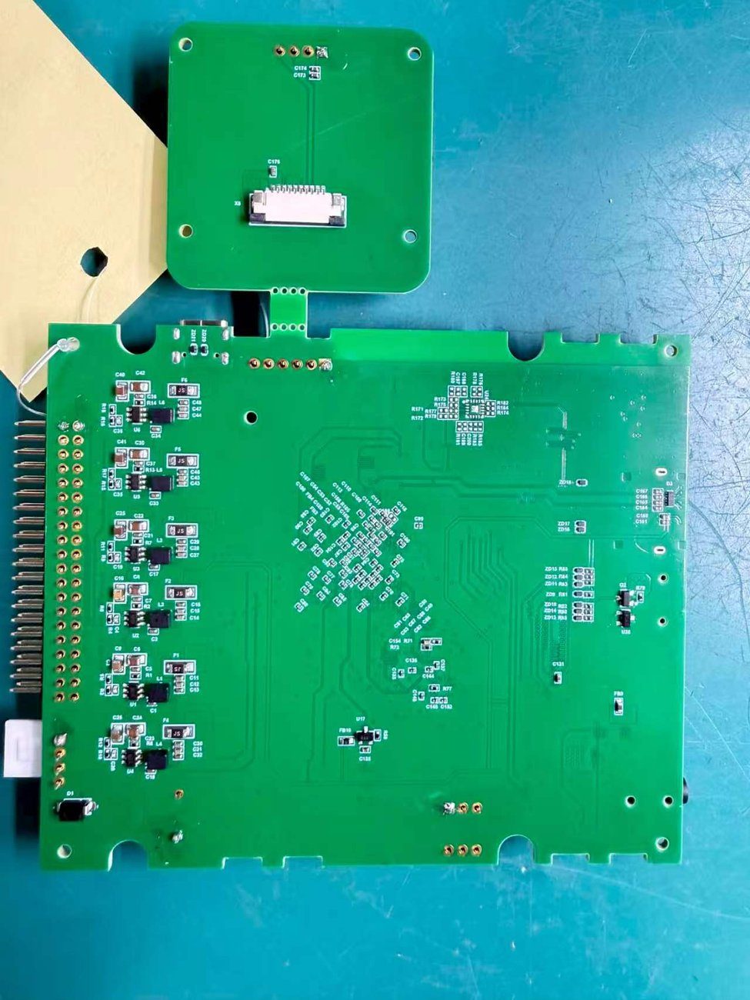</td></tr>
</table>

#### Project Description

Designed and developed a high-performance **FPGA-based Digital Signal Processing (DSP) platform** for real-time signal processing, software-defined radio (SDR), audio applications, and embedded computing research.

**Key Features**

- Xilinx Artix-7 FPGA (XC7A100T-2FGG484I)
- High-capacity programmable logic for custom DSP and hardware acceleration
- SDIO interface for standard SD card connectivity
- SD Express interface for high-speed storage applications
- W25Q01JVZEIQ NOR Flash memory for FPGA boot configuration and firmware storage
- ESP32 wireless subsystem connected via QSPI interface to the FPGA
- Integrated Wi-Fi connectivity for remote communication and control
- TLV320DAC3100 audio codec for high-quality audio input / output and digital audio processing
- Custom FPGA logic implementation for real-time signal processing and hardware acceleration
- Flexible architecture supporting embedded Linux, bare-metal applications, and custom FPGA designs

**Applications**

The OpenFloppy platform is designed for digital signal processing, software-defined radio (SDR), audio processing, wireless communication research, FPGA development, edge computing, industrial control, and rapid prototyping of custom hardware-acceleration solutions. The combination of FPGA processing, high-speed storage interfaces, wireless connectivity, and audio capabilities makes it suitable for advanced embedded and research applications.

#### Design Standards & Compliance
- **High-Speed PCB Design** — controlled-impedance digital routing for FPGA banks
- **Signal Integrity** — length matching across FPGA I/O, QSPI, and SD Express buses
- **Power Integrity** — multi-rail PDN with decoupling and sequencing for FPGA core / VCCAUX / VCCIO
- **SD Express Differential Routing** — high-speed differential pair routing for PCIe-class lanes
- **QSPI Routing** — controlled impedance and length matching between FPGA and ESP32
- **Mixed-Signal Layout** — analog / digital ground partitioning for the audio codec
- **EMC / EMI** — clock-noise mitigation, return-path management
- **IPC Standards** — IPC-2221, IPC-A-600

---

### 05. Allwinner H3 Processor Board — Custom HDMI Switching System
> Embedded multimedia processing board with custom HDMI switching architecture.

**Category:** *Embedded Computing & Edge AI*
**Role:** *Hardware Design Engineer*

<table>
<tr><td width="50%">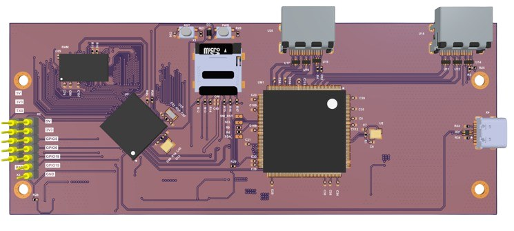</td><td width="50%">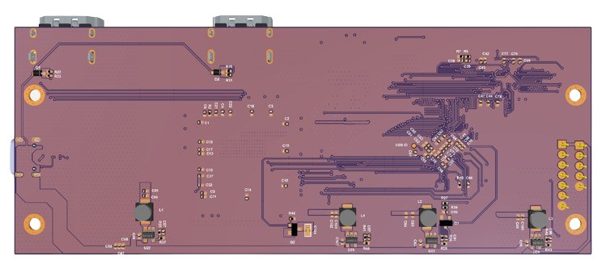</td></tr>
<tr><td colspan="2">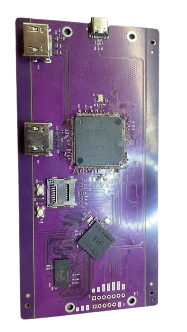</td></tr>
</table>

#### Project Description

Designed and developed an embedded multimedia processing board based on the **Allwinner H3** application processor, featuring a **custom HDMI switching architecture** for flexible video routing and display management applications.

**Key Features**

- Allwinner H3 quad-core ARM Cortex-A7 processor
- Custom HDMI switcher implementation using a dedicated HDMI switching IC
- Single HDMI input source support
- Dynamic HDMI signal routing and switching capability
- Configurable HDMI output assignment based on application requirements
- High-definition video processing and display support
- Embedded Linux operating system integration
- Optimised PCB design for high-speed HDMI signal integrity

**Applications**

The platform is designed for digital signage, multimedia distribution systems, video surveillance displays, conference-room systems, industrial HMIs, and custom video-routing applications. The custom HDMI switching architecture enables flexible video source management and seamless display control tailored to specific customer requirements.

#### Design Standards & Compliance
- **High-Speed PCB Design** — DDR3 fly-by routing and HDMI controlled-impedance routing
- **Signal Integrity** — HDMI TMDS differential-pair impedance control, length matching
- **HDMI Switching Topology** — careful routing through the switching IC to preserve TMDS integrity
- **EMC / EMI** — HDMI clock-noise mitigation, shielding strategy
- **ESD Protection** — IEC 61000-4-2 on HDMI input / output connectors
- **IPC Standards** — IPC-2221, IPC-A-600

---

### 06. E-Bike IoT Control Board
> ESP32-based smart connected control system for next-generation mobility.

**Category:** *Connectivity, IoT & Automotive*
**Role:** *Lead Electronics Design Engineer, Malcan Technologies Sdn Bhd, Malaysia*

<table>
<tr><td width="50%">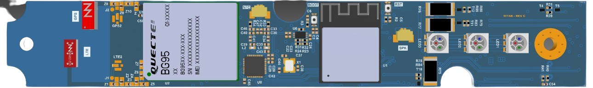</td><td width="50%">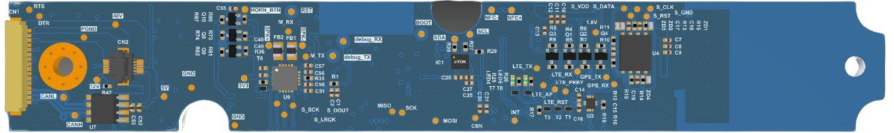</td></tr>
<tr><td colspan="2">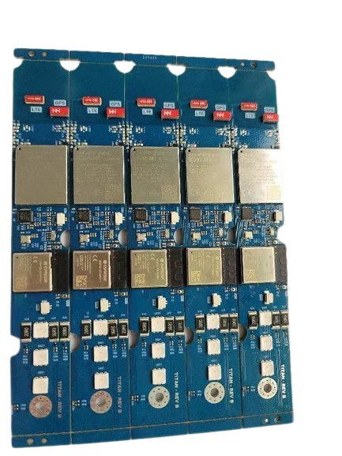</td></tr>
</table>

#### Project Description

Designed and developed a smart **IoT-enabled E-Bike control system** based on the **ESP32** platform, providing vehicle tracking, wireless access control, battery monitoring, cloud connectivity, and motor communication for next-generation connected mobility solutions.

**Key Features**

- ESP32-based main controller for system management and wireless communication
- Real-time GPS location tracking and vehicle coordinate reporting
- Integrated cellular connectivity using **Quectel BG96** LTE Cat-M1 / NB-IoT module with eSIM support
- BLE-based smart locking and unlocking functionality via mobile application
- NFC card authentication for secure bike access and unlocking
- RGB LED status indication for battery level, charging status, connectivity, and system notifications
- CAN bus communication interface for motor controller integration
- Cloud-based monitoring and fleet-management capability
- Remote diagnostics and status reporting
- Low-power operation optimised for battery-powered applications
- Secure wireless communication and device authentication

**Applications**

The platform is designed for smart e-bikes, electric scooters, shared mobility services, fleet management systems, connected transportation solutions, and IoT-enabled electric vehicle ecosystems requiring secure access control, location tracking, and real-time connectivity.

#### Design Standards & Compliance
- **RF Module Integration** — BLE / Wi-Fi (ESP32), LTE / NB-IoT, NFC antennas and matching networks
- **Multi-Radio Coexistence** — ESP32 + cellular + NFC sharing board space
- **EMC / EMI** — radiated emissions control across multiple radios
- **ESD Protection** — IEC 61000-4-2 on all user-facing and external interfaces
- **Regulatory** — FCC and CE design compliance for consumer / mobility use
- **CAN Bus** — automotive-grade routing, termination, common-mode filtering
- **Low-Power Design** — power-domain partitioning and sleep-state management for battery operation
- **Secure Communication** — provisioning and authentication architecture for cloud connectivity

---

### 07. Telecom Tower-Room OCD Controller
> Operation & Control Device for telecom tower infrastructure — remote monitoring, environmental control, and surge protection.

**Category:** *Industrial Control, Telecom Infrastructure*
**Role:** *Hardware Design Engineer*

<table>
<tr><td width="50%">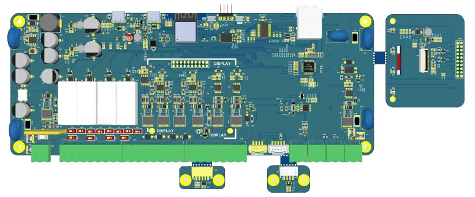</td><td width="50%">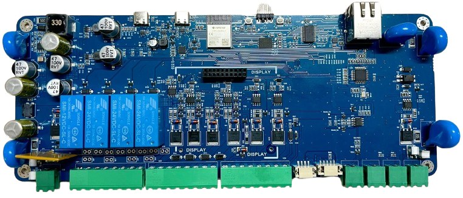</td></tr>
</table>

#### Project Description

Designed and developed an **industrial-grade Operation and Control Device (OCD) Controller** for telecommunication tower infrastructure management, providing remote monitoring, environmental control, equipment protection, security management, and communication capabilities.

**Key Features**

- ESP32-based main controller for system management and monitoring
- Control and monitoring of telecommunication power and auxiliary loads
- Automatic hazard / obstruction warning-light control for telecom towers
- Temperature-based fan control for equipment cabinets and control rooms
- RS-485 communication interface for integration with remote devices and sensors
- 128 MB Flash memory for event logging, system records, and diagnostics
- Ethernet connectivity for remote monitoring and management
- Control-room security monitoring and access management
- Integrated **camera** for video surveillance of the shelter / control room
- **PIR motion sensor** for intrusion and presence detection
- **Fire alarm interface** for fire detection and emergency response
- Real-time alarm and fault notification system
- Remote configuration and firmware update capability
- Industrial-grade reliability for 24 / 7 operation

**Protection Features**

- Lightning surge protection using Gas Discharge Tubes (GDT)
- High-energy transient suppression using Metal Oxide Varistors (MOV)
- Fast-transient and ESD protection using TVS diodes
- Protection against high-voltage spikes and electrical surges
- Enhanced reliability for outdoor telecom-infrastructure environments

**Applications**

The OCD Controller is designed for telecommunications towers, cellular base stations, network-infrastructure shelters, remote communication sites, data-communication facilities, and industrial monitoring systems requiring reliable environmental control, equipment protection, remote management, and operational logging.

#### Design Standards & Compliance
- **Surge & Lightning Protection** — multi-stage GDT / MOV / TVS protection topology (IEC 61000-4-5)
- **ESD Protection** — IEC 61000-4-2 on all field I/O and external interfaces
- **EMC / EMI** — industrial-environment immunity and emissions control
- **Power Integrity** — robust power conditioning for unmanned 24 / 7 operation
- **Ethernet Routing** — controlled-impedance differential pair routing, magnetics integration
- **RS-485 Bus** — termination, common-mode filtering, isolation considerations
- **Mains / Load Isolation** — clearance and creepage for relay-driven AC loads
- **IPC Standards** — IPC-2221, IPC-A-610 for industrial reliability

---

### 08. Multi-Language Smart Keyboard with OLED Key Display
> Innovative keyboard with an individual OLED display in every keycap — supports 50+ languages.

**Category:** *Consumer Electronics & HMI*
**Role:** *Hardware Design Engineer*

<table>
<tr><td width="50%">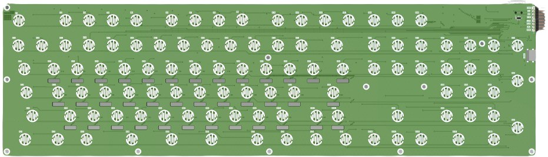</td><td width="50%">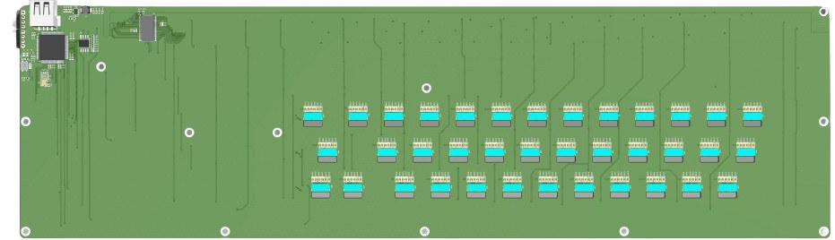</td></tr>
<tr><td width="50%">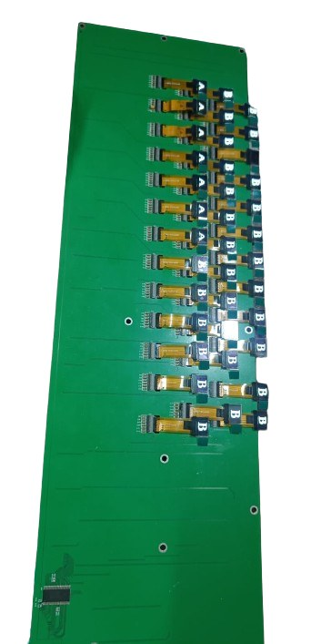</td><td width="50%">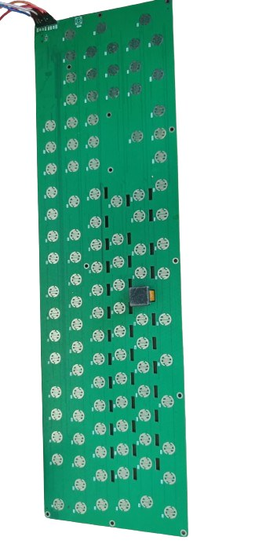</td></tr>
</table>

#### Project Description

Designed and developed an innovative **smart keyboard platform** capable of supporting more than **50 languages** through dynamically configurable key layouts. The system uses **individual OLED displays integrated into each key**, allowing real-time character and language adaptation without changing physical keycaps.

**Key Features**

- STM32F3-series microcontroller-based architecture
- Individual OLED display integrated into each keycap
- Dynamic key labelling with real-time character updates
- Support for 50+ international languages and keyboard layouts
- Dedicated language-switching button for instant layout changes
- 64 MB onboard Flash memory for language packs, fonts, and configuration data
- User-configurable keyboard layouts and custom mappings
- Real-time display updates for multilingual input
- Compact and ergonomic keyboard design
- Low-power embedded system architecture

**Applications**

The Multi-Language Smart Keyboard is designed for multilingual users, translators, educational institutions, government organisations, international businesses, software developers, and accessibility applications. The dynamic OLED key technology enables seamless switching between more than 50 languages on a single keyboard, eliminating the need for multiple physical keyboards or printed multilingual keycaps.

#### Design Standards & Compliance
- **High-Density PCB Layout** — driving an array of per-key OLED displays with minimal trace congestion
- **Signal Integrity** — clean OLED display interfaces (SPI / I²C) routed across the keyboard matrix
- **EMC / EMI** — display clock-noise control across many simultaneous OLEDs
- **ESD Protection** — IEC 61000-4-2 on key inputs and external interfaces
- **Low-Power Design** — power-domain partitioning, OLED dimming / refresh control
- **Mechanical Integration** — PCB layout coordinated with keycap mechanics and OLED placement
- **IPC Standards** — IPC-2221, IPC-A-610

---

### 09. MTK6261D Feature Phone
> Cost-optimised feature phone platform for entry-level and emerging-market applications.

**Category:** *Consumer Electronics*
**Role:** *Assistant Director (R&I Hardware), Walton Hi-Tech Industries PLC, Bangladesh*

<table>
<tr><td width="50%">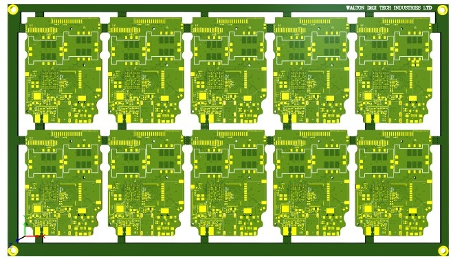</td><td width="50%">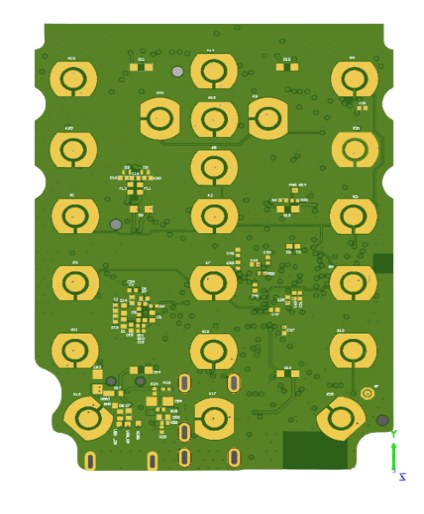</td></tr>
<tr><td width="50%">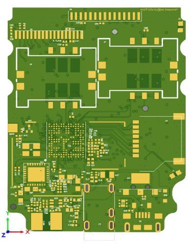</td><td width="50%">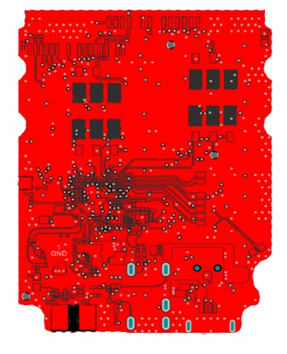</td></tr>
<tr><td width="50%">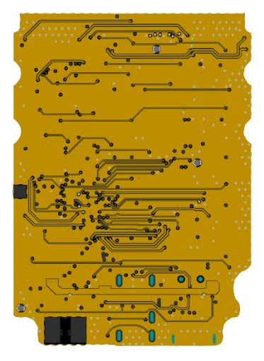</td><td width="50%">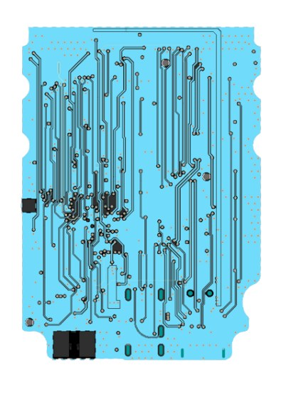</td></tr>
<tr><td width="50%">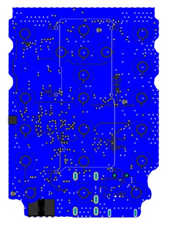</td><td width="50%">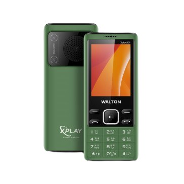</td></tr>
</table>

#### Project Description

Designed and developed a **cost-optimised feature phone platform** based on the MediaTek MTK6261D mobile processor, targeting entry-level and emerging-market applications. The design focused on **low manufacturing cost, high reliability, and essential communication features** while maintaining a compact PCB implementation.

**Key Features**

- MediaTek MTK6261D all-in-one mobile SoC
- Low-cost 4-layer PCB design optimised for mass production
- Classic feature-phone form factor with physical keypad
- 3.5-inch colour display
- Dual SIM support for multi-network operation
- Integrated Bluetooth connectivity
- RF front-end design for GSM cellular communication
- 2 MP camera module support
- MicroSD card expansion slot
- Battery Management System (BMS) for charging and battery protection
- Integrated audio subsystem for voice calls and multimedia
- Compact and power-efficient architecture

**Applications**

The MTK6261D Feature Phone is designed for cost-sensitive consumer markets, emerging economies, enterprise communication devices, educational programs, and users requiring a reliable and affordable mobile communication solution. The platform delivers essential mobile-phone functionality with low power consumption and reduced manufacturing cost.

#### Design Standards & Compliance
- **RF Module Integration** — GSM RF front-end, antenna matching, dual-SIM RF switching
- **EMC / EMI** — mixed-signal noise isolation between RF, audio, and digital domains
- **Regulatory** — FCC and CE design considerations for GSM and Bluetooth
- **Dense Mixed-Signal Layout** — compact motherboard with careful analog / digital / RF partitioning
- **Design for Manufacturability (DFM)** — 4-layer stack-up, panel-friendly layout, low-cost components, IPC-A-610 acceptance
- **Battery / Power Safety** — BMS layout, charge-path isolation, thermal considerations
- **ESD Protection** — IEC 61000-4-2 on SIM, MicroSD, audio jack, charging port, and keypad
- **IPC Standards** — IPC-2221, IPC-A-610

---

### 10. Smart Refrigerator Frost Controller with Capacitive Touch Interface
> Cost-effective refrigerator controller supporting both induction and inverter BLDC compressors.

**Category:** *Appliance Electronics*
**Role:** *Assistant Director (R&I Hardware), Walton Hi-Tech Industries PLC, Bangladesh*

<table>
<tr><td width="50%">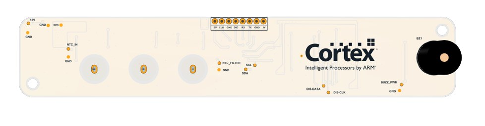</td><td width="50%">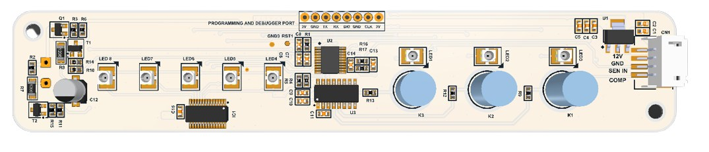</td></tr>
<tr><td width="50%">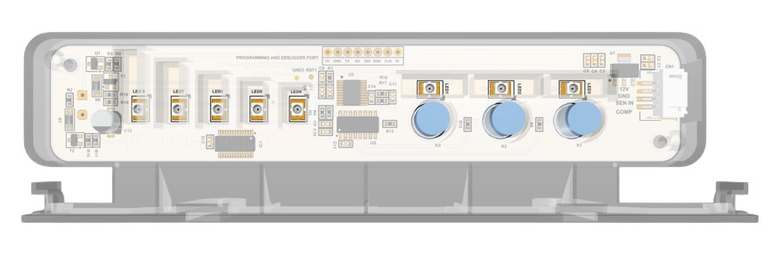</td><td width="50%">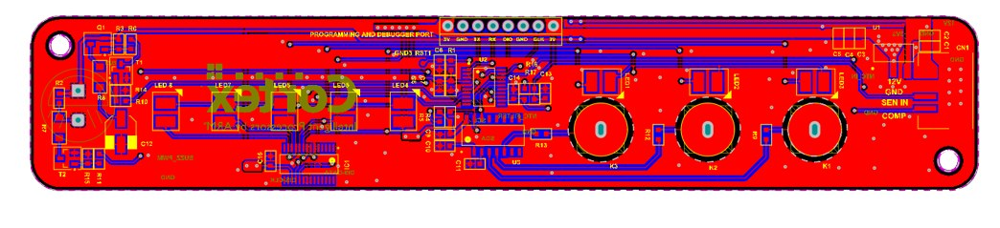</td></tr>
<tr><td colspan="2">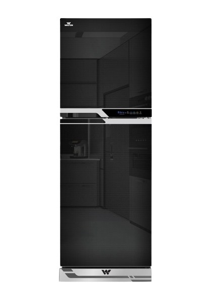</td></tr>
</table>

#### Project Description

Designed and developed a **cost-effective refrigerator frost controller** for domestic and commercial refrigeration systems. The controller provides temperature monitoring, compressor control, user-interface management, and safety features through a **capacitive touch-based control panel**.

**Key Features**

- STM32G0-series low-cost 32-bit microcontroller
- Dedicated capacitive touch controller IC interfaced via I²C
- Support for both induction compressor (relay control) and inverter BLDC compressor control
- NTC temperature-sensor interface for cabinet temperature monitoring
- Capacitive touch user interface with multiple touch keys
- Dual seven-segment LED display for temperature, operating mode, and fault indication
- Child-lock functionality activated through long-press touch operation
- Multiple refrigerator operating-mode selections
- Real-time temperature control and monitoring
- Low-power embedded system architecture

**Applications**

The Frost Controller is designed for household refrigerators, commercial refrigeration equipment, beverage coolers, display refrigerators, mini refrigerators, and energy-efficient inverter-based cooling systems. The capacitive touch interface and digital display provide a modern user experience while maintaining a low-cost and highly reliable control solution.

#### Design Standards & Compliance
- **ESD Protection** — IEC 61000-4-2 on touch panel (critical for capacitive sensing reliability)
- **EMC / EMI** — appliance-environment immunity and emissions
- **Mains Isolation & Safety** — clearance / creepage for relay-driven AC loads, conformal coating considerations
- **Mixed-Signal Layout** — analog NTC sensing isolated from digital and relay-switching domains
- **Capacitive Touch Routing** — shielded sensor traces, ground-pour discipline for stable sensing
- **BLDC Compressor Control** — clean PWM / control-signal routing to the inverter driver
- **Regulatory** — CE design compliance for household appliances
- **IPC Standards** — IPC-2221, IPC-A-610

---

### 11. Smart Chest Freezer Controller — STM32G0 / PIC32 Variants
> Digital control platform for chest freezers, with dual-MCU variants supporting both induction and BLDC inverter compressors.

**Category:** *Appliance Electronics*
**Role:** *Assistant Director (R&I Hardware), Walton Hi-Tech Industries PLC, Bangladesh*

<table>
<tr><td width="50%">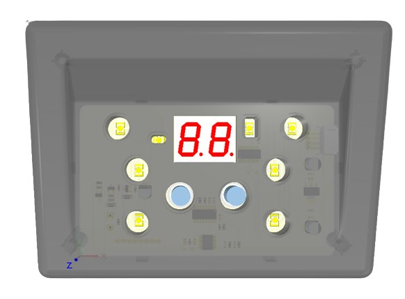</td><td width="50%">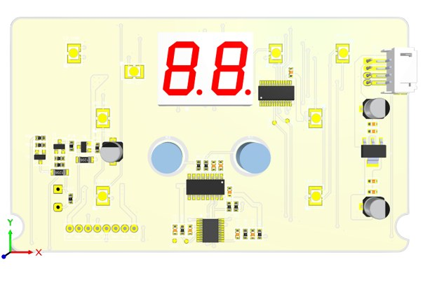</td></tr>
<tr><td width="50%">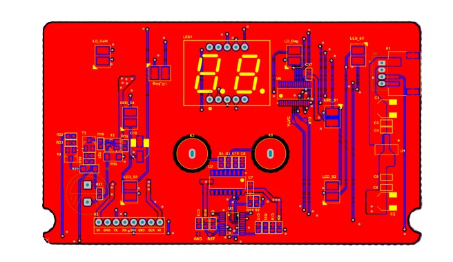</td><td width="50%">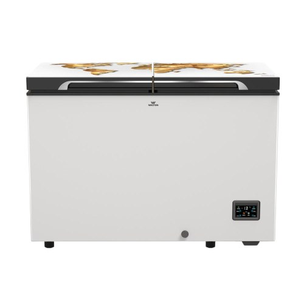</td></tr>
</table>

#### Project Description

Developed a **digital control system for chest freezers**, available in both **STM32G0** and **PIC32** microcontroller variants. The platform was engineered as a low-cost appliance controller suitable for high-volume consumer-product manufacturing, with a **common hardware and firmware architecture** that supports multiple freezer product variants on a single platform.

**Key Features**

- Dual MCU options — STM32G0 and PIC32 — sharing a common platform architecture
- Cabinet temperature monitoring with precision NTC temperature sensors
- Support for both relay-driven induction compressors and inverter-based BLDC compressors
- Dedicated capacitive touch controller IC interfaced via I²C
- Capacitive touch user interface for temperature adjustment and mode selection
- Dual seven-segment LED display for temperature, operating status, and fault indication
- Child Lock activated via long-press touch detection
- Operating modes: **Fast Freeze, Eco Mode, Normal Operation**

- Diagnostic error-code reporting for field troubleshooting and maintenance
- Firmware optimised for low-cost embedded hardware and appliance-grade reliability
- Multi-product platform reuse — single architecture across multiple freezer SKUs

**Applications**

The platform is designed for chest freezers, deep freezers, ice-cream freezers, commercial cold-storage units, beverage freezers, and other high-volume consumer cold-storage products requiring reliable digital control, capacitive touch user experience, and a flexible architecture supporting multiple product variants.

#### Design Standards & Compliance
- **ESD Protection** — IEC 61000-4-2 on touch panel and external interfaces
- **EMC / EMI** — appliance-environment immunity and conducted-emission control
- **Mains Isolation & Safety** — clearance / creepage for relay-driven AC loads
- **Mixed-Signal Layout** — analog NTC sensing isolated from digital and switching domains
- **Capacitive Touch Routing** — shielded sensor traces, ground-pour discipline for stable sensing
- **BLDC Compressor Control** — clean PWM / control-signal routing to the inverter driver
- **Platform Reusability** — common PCB and firmware base across multiple freezer SKUs (variant-aware design)
- **Regulatory** — CE design compliance for household appliances
- **IPC Standards** — IPC-2221, IPC-A-610

---

### 12. Rechargeable Fan Controller
> AC + battery dual-power fan platform with automatic backup and dual-motor PWM control.

**Category:** *Appliance Electronics, Power Electronics*
**Role:** *Assistant Director (R&I Hardware), Walton Hi-Tech Industries PLC, Bangladesh*

<table>
<tr><td width="50%">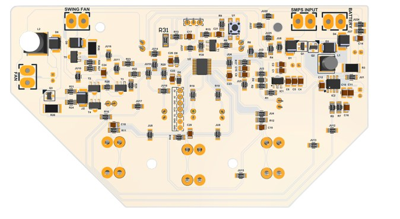</td><td width="50%">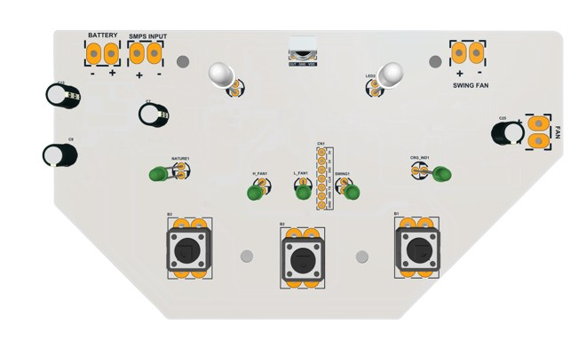</td></tr>
<tr><td width="50%">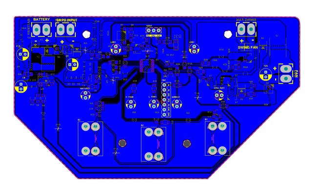</td><td width="50%">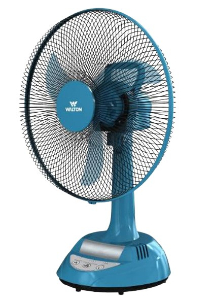</td></tr>
</table>

#### Project Description

Developed a **microcontroller-based rechargeable fan control system** designed for uninterrupted operation in residential and commercial environments with unreliable power supply conditions. The system integrates **AC mains operation, battery backup, motor control, and intelligent power management** into a single low-cost embedded platform.

The design is based on the **STM32G0** series microcontroller and enables **seamless transition between AC power and 12 V lead-acid battery operation**. During normal conditions, the system operates the fan while simultaneously charging the battery through an SMPS-based power stage. In case of AC failure, the system automatically switches to battery mode to ensure continuous operation without user intervention.

A **dual-motor architecture** is implemented to independently control the main fan motor and the oscillation (swing) motor. **PWM-based control at 12 kHz** is used to regulate fan speed efficiently using a **totem-pole driver stage**, ensuring smooth operation and improved energy efficiency.

The user interface is designed with a simple and robust **three-button control system**, allowing intuitive operation for power control, speed adjustment, and swing mode activation.

**Technical Highlights**

- STM32G0-series low-cost microcontroller-based control system
- Dual power-source architecture — AC mains + 12 V lead-acid battery backup
- Automatic power switching between AC and battery operation
- SMPS-based power supply for system operation and battery charging
- Integrated lead-acid Battery Management System (BMS) for protection and charging control
- Simultaneous fan operation and battery charging during AC mode
- PWM-based fan-speed control at 12 kHz switching frequency
- Totem-pole driver stage for efficient fan-motor driving
- Dual motor control system:
 - Main fan motor speed control
 - Oscillation (swing) motor control
- Three-button user interface:
 - Power ON / OFF control
 - Fan speed selection
 - Oscillation (swing) control
- Low-voltage battery protection and cutoff mechanism
- Power-failure detection with automatic backup activation
- Optimised embedded firmware for real-time control and power efficiency
- Low-cost appliance-grade PCB design for mass production

**Project Outcome**

- Delivered a reliable rechargeable fan system capable of uninterrupted operation during power outages
- Improved overall energy efficiency through optimised PWM motor control
- Achieved seamless AC-to-battery transition without user impact
- Extended battery lifespan through controlled charging and protection logic
- Reduced system cost while maintaining industrial-grade reliability
- Enabled scalable design for multiple rechargeable fan product variants

#### Design Standards & Compliance
- **Mains Isolation & Safety** — clearance / creepage for AC-input front-end, BMS isolation considerations
- **Power Electronics** — SMPS topology, AC-DC conversion, motor PWM drive stage
- **Battery / BMS Design** — lead-acid charge profile, low-voltage cutoff, protection logic
- **Automatic Power Changeover** — make-before-break / seamless source switching design
- **EMC / EMI** — SMPS switching-noise mitigation, PWM motor-drive emission control
- **Mixed-Signal Layout** — analog battery sensing isolated from switching and motor-drive domains
- **ESD Protection** — IEC 61000-4-2 on user controls, AC input, and battery terminals
- **Regulatory** — CE design compliance for mains-connected household appliance
- **DFM** — low-cost PCB, panel-friendly layout, IPC-A-610 acceptance for mass production
- **IPC Standards** — IPC-2221, IPC-A-610

---

### 13. IoT-Enabled 5-Inch RGB TFT Refrigerator Controller
> Smart appliance controller — ESP32-S3, parallel-RGB TFT, Wi-Fi IoT, and dual compressor support.

**Category:** *Connectivity, IoT & HMI, Appliance Electronics*
**Role:** *Hardware Design Engineer*

<table>
<tr><td width="50%">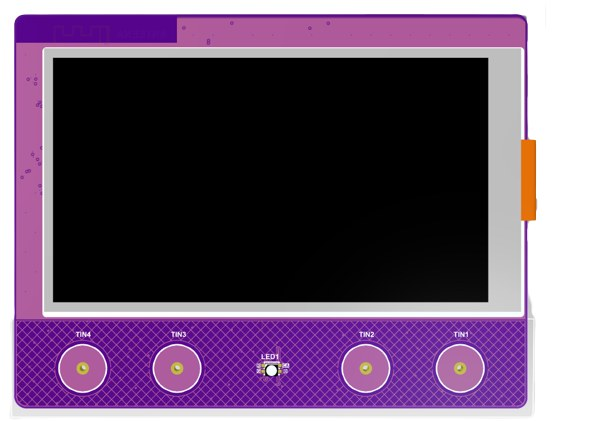</td><td width="50%">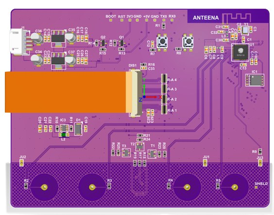</td></tr>
<tr><td colspan="2">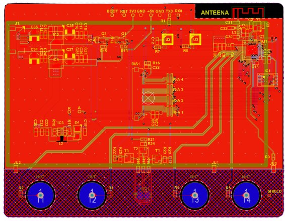</td></tr>
</table>

#### Project Description

Developed a **smart refrigerator control and monitoring system** based on the **ESP32-S3**, integrating a high-resolution **5-inch RGB TFT display** with modern IoT connectivity for intelligent appliance management.

The system is designed to provide a complete user interface for temperature control, mode selection, and real-time monitoring of refrigerator performance. A **parallel RGB (888) interface TFT display** is used to render a modern graphical UI, while **ESP32-S3 GPIO-based capacitive touch inputs** are utilised to implement a touch keypad system for user interaction.

The controller continuously monitors cabinet temperature using external temperature-sensing circuitry and maintains precise thermal regulation through intelligent control of both conventional and inverter-based refrigeration systems. It supports **relay-based switching for induction compressors** as well as **control-signal output for BLDC inverter compressor controllers**.

Built-in **Wi-Fi connectivity** enables remote monitoring and control through a mobile application, allowing users to adjust settings and track system status from anywhere via IoT connectivity.

**Technical Highlights**

- ESP32-S3 high-performance MCU as main controller
- 5-inch TFT display with RGB 888 parallel interface
- Modern graphical UI for temperature control and system monitoring
- GPIO-based touch keypad implementation using ESP32-S3
- Real-time cabinet temperature sensing and feedback control
- Relay control for conventional induction compressor systems
- Digital control signals for inverter BLDC compressor operation
- Dual-mode compressor support (relay + inverter interface)
- Wi-Fi-enabled IoT connectivity for remote monitoring and control
- Mobile-app integration for refrigerator management
- Embedded firmware for display handling, touch input, and control logic
- Low-cost smart-appliance architecture optimised for mass production

**Project Outcome**

- Delivered a smart refrigerator controller with modern graphical UI and IoT capability
- Enabled remote temperature monitoring and control via Wi-Fi connectivity
- Improved user experience through 5-inch TFT-based interactive display
- Supported both legacy and inverter compressor systems in a single platform
- Reduced system complexity by integrating display, touch, and control on ESP32-S3
- Created a scalable architecture for next-generation smart appliance products

#### Design Standards & Compliance
- **High-Speed PCB Design** — RGB 888 parallel-bus routing (24 data lanes + sync signals)
- **Signal Integrity** — display-bus length matching, controlled impedance for RGB lanes
- **RF / Wi-Fi Integration** — ESP32-S3 antenna routing, RF front-end keepout
- **EMC / EMI** — display clock-noise mitigation, Wi-Fi emissions control, compressor-switching isolation
- **Mains Isolation & Safety** — clearance / creepage for relay-driven AC compressor loads
- **BLDC Compressor Control** — clean PWM / control-signal routing to inverter driver
- **Mixed-Signal Layout** — analog temperature sensing isolated from digital, RF, and switching domains
- **ESD Protection** — IEC 61000-4-2 on touch panel, AC input, and external interfaces
- **Regulatory** — FCC and CE design compliance for Wi-Fi and mains-connected appliance
- **IPC Standards** — IPC-2221, IPC-A-610

---

### 14. Consumer AC-Operated LED Light Controller
> Low-cost non-isolated AC-DC LED driver for residential and commercial lighting.

**Category:** *Power Electronics, Consumer Lighting*
**Role:** *Hardware Design Engineer*

<table>
<tr><td width="50%">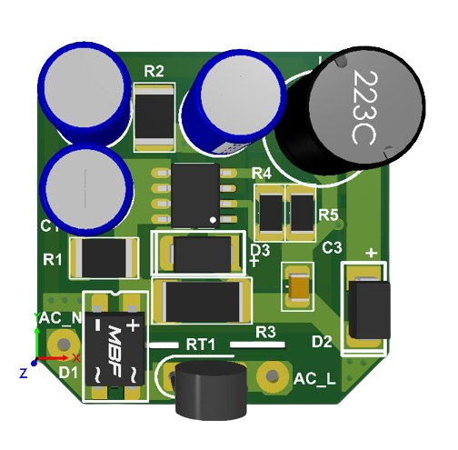</td><td width="50%">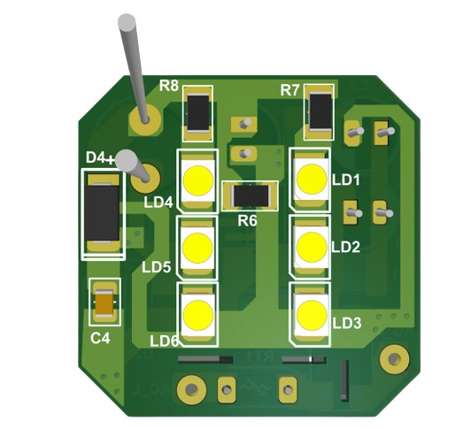</td></tr>
<tr><td colspan="2">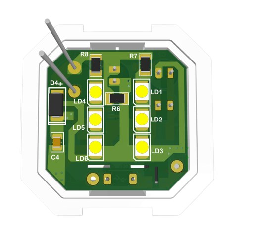</td></tr>
</table>

#### Project Description

Developed a **low-cost AC-powered LED lighting driver system** designed for residential and commercial lighting applications, focusing on high efficiency, compact design, and cost-optimised power conversion.

The system uses a **non-isolated AC-to-DC conversion stage** to directly derive low-voltage DC from 220 V AC input, which is then regulated and used to drive a high-efficiency LED array through a **PWM-based LED driver IC**. The architecture is optimised for minimal component count while maintaining stable brightness control and reliable long-term operation.

**Technical Highlights**

- AC mains input — 220 V AC direct-input design
- Non-isolated AC-to-DC conversion IC solution for 12 V DC generation
- Cost-optimised power stage with minimal component count
- PWM-based LED driver IC for controlled current regulation
- High-efficiency LED-array driving architecture
- Stable brightness control using PWM dimming technique
- Compact PCB design optimised for consumer lighting products
- Thermal and surge considerations for AC-direct-operated systems
- Low-cost mass-production-oriented hardware design

**Project Outcome**

- Delivered a highly cost-efficient LED lighting driver solution for consumer applications
- Achieved stable and flicker-free LED brightness control using PWM driving
- Reduced overall BOM cost through non-isolated AC-to-DC architecture
- Improved efficiency and reliability for long-duration operation
- Designed a scalable platform suitable for multiple LED lighting product variants

#### Design Standards & Compliance
- **Power Electronics** — non-isolated AC-DC topology, constant-current LED driving
- **Mains Safety** — clearance / creepage for mains-referenced low-voltage rail (non-isolated topology — entire low-voltage side is hot)
- **Surge & Transient Protection** — input transient suppression for AC-line events
- **EMC / EMI** — conducted and radiated emissions from the switching converter, EMI filtering
- **Thermal Design** — power-stage heat dissipation, LED-array thermal management
- **PWM Dimming** — flicker-free current modulation for stable perceived brightness
- **DFM** — minimal-component-count layout for mass production, IPC-A-610 acceptance
- **Regulatory** — CE design compliance for mains-connected consumer lighting
- **IPC Standards** — IPC-2221, IPC-A-610

---

### 15. IoT Module for Connected Appliances — Wi-Fi / BLE Gateway
> Universal ESP32-S3 connectivity module that upgrades existing appliances into smart products — no host redesign required.

**Category:** *Connectivity & IoT*
**Role:** *Assistant Director (R&I Hardware), Walton Hi-Tech Industries PLC, Bangladesh*

<table>
<tr><td width="50%">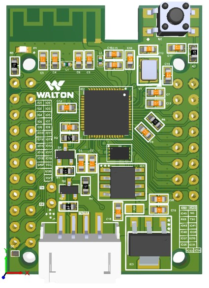</td><td width="50%">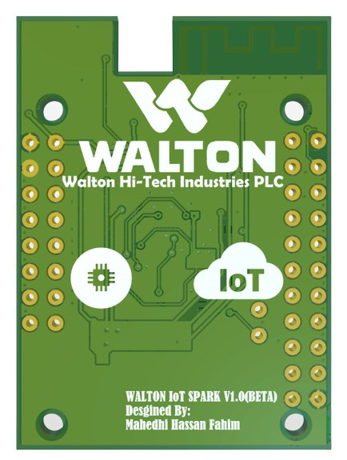</td></tr>
<tr><td width="50%">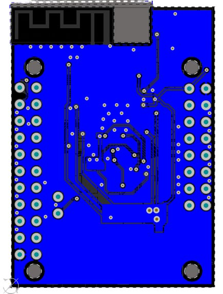</td><td width="50%">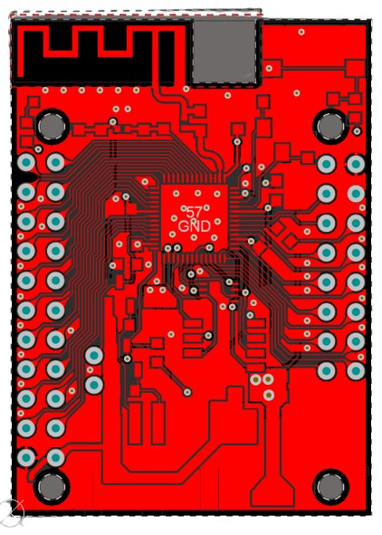</td></tr>
</table>

#### Project Description

Developed a **universal IoT module** designed to upgrade existing home appliances into smart connected systems **without requiring redesign of the main appliance controller hardware or firmware**.

The module is built around the **ESP32-S3** platform and functions as an external connectivity gateway, enabling both **Wi-Fi and Bluetooth Low Energy (BLE)** communication. It bridges legacy appliance controllers with modern cloud and mobile applications, allowing remote monitoring, control, and automation features to be added to existing products.

The module communicates with the host appliance MCU through **UART**, translating cloud / app commands into appliance-level control signals and returning real-time status updates back to the IoT server.

**Technical Highlights**

- ESP32-S3-based dual-mode IoT module (Wi-Fi + BLE)
- Designed to upgrade existing appliances without hardware redesign
- UART interface for communication with legacy appliance controllers
- Supports bidirectional data exchange (control commands + status feedback)
- Wi-Fi connectivity for cloud-based remote monitoring and control
- BLE support for local pairing, provisioning, and mobile-app control
- Lightweight communication protocol for appliance integration
- Compatible with multiple appliances:
 - Air conditioners
 - Washing machines
 - Ovens
 - Other smart home devices
- Secure IoT communication architecture with authentication support
- Low-power embedded firmware optimised for always-on connectivity
- Compact module design for easy integration into existing PCB layouts

**Project Outcome**

- Enabled rapid IoT transformation of existing non-smart appliances
- Reduced product redevelopment cost for manufacturers
- Provided dual connectivity options (Wi-Fi and BLE) for flexible deployment scenarios
- Improved user experience with remote control and mobile-app integration
- Created a scalable and reusable IoT gateway platform for multiple appliance categories

#### Design Standards & Compliance
- **RF Module Integration** — Wi-Fi + BLE antenna routing, matching network, RF keepout
- **EMC / EMI** — emissions control in noisy appliance environments (compressor, motor, switching loads nearby)
- **Regulatory** — FCC and CE design compliance for Wi-Fi / BLE consumer use
- **ESD Protection** — IEC 61000-4-2 on UART pins and external module-edge connectors
- **UART Interface Design** — robust signaling and grounding between module and host MCU
- **Low-Power Design** — power-domain partitioning for always-on connectivity
- **Secure Communication** — provisioning, authentication, and encrypted cloud transport
- **Modular Architecture** — common module reusable across multiple appliance categories
- **IPC Standards** — IPC-2221, IPC-A-610

---

## Experience Certificates

Official employment and experience documentation from previous employers (most recent first):

### Sanion Co., Ltd. — Assistant Researcher, Hardware Team
**Feb 2026 – May 2026, Incheon, South Korea**
*Hardware research and development*

[**Download Full Letter (PDF)**](assets/certificates/Sanion_Employment_Confirmation_Letter.pdf)

---

### Elliance Sdn Bhd — Senior Electronic Engineer
**Jan 2025 – Feb 2026, Penang, Malaysia**
*Hardware design, embedded systems development, and technical leadership*

<a href="assets/certificates/Elliance_Experience_Certificate.pdf">
 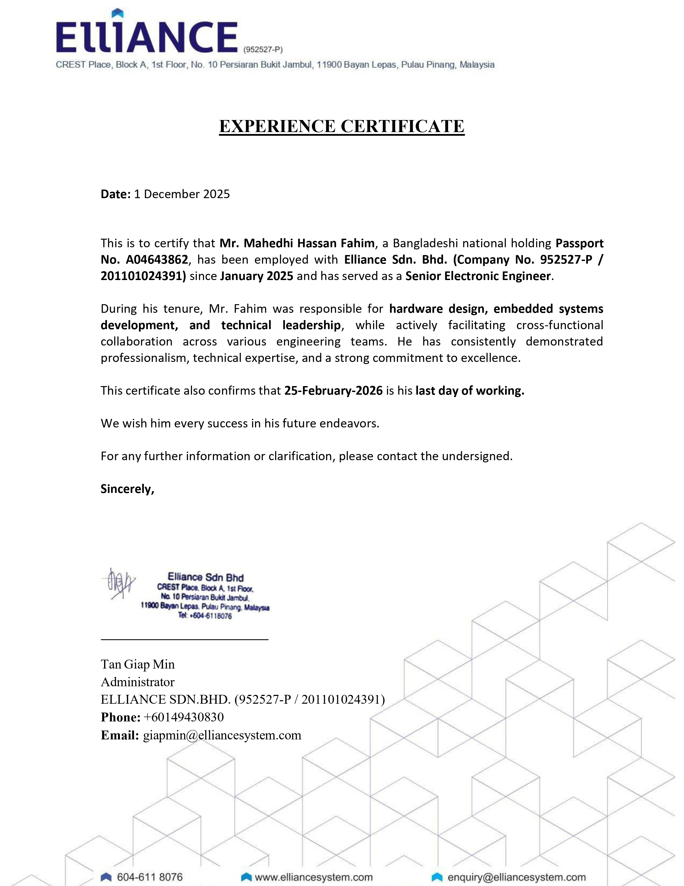
</a>

[**Download Full Certificate (PDF)**](assets/certificates/Elliance_Experience_Certificate.pdf)

---

### Malcan Technologies Sdn Bhd — Electronic Engineer
**Sep 2023 – Jan 2025, Penang, Malaysia**
*Research & Development engineering, product development, and hardware design*

[**Download Full Certificate (PDF)**](assets/certificates/Malcan_Experience_Certificate.pdf)

---

## Education

**B.Sc. in Electrical and Electronic Engineering (EEE)**, *2015 – 2019*
Shahjalal University of Science and Technology, Sylhet, Bangladesh
GPA: **3.34 / 4.00**

---

## Research & Publications

- **Senior Thesis** — *"Hardware Implementation of a Neural Network on an FPGA Using the Altera DE2-115 Development Board."*
- **Conference Paper** — Presented at the International Conference on Engineering Research, Innovation & Education (**ICERIE**), Paper ID **167**, February 2021.

---

## Awards & Achievements

- **2nd Runner-up** — SUST Mechnovation
- **2nd Runner-up** — DUET Techfest '20
- **International Final-Round Qualifier** (Bangladesh zone) — Techkriti '20
- **4th Place** — BUBT BEC Robo Mania
- **5th Place** — BUP Tech Surge

---

## Languages

- **Bengali** — Native
- **English** — Advanced

---

## Professional Experience Summary

| Period | Role | Company | Location |
|---|---|---|---|
| Feb 2026 – May 2026 | Assistant Researcher, Hardware Team | **Sanion Co., Ltd.** | Incheon, South Korea |
| Jan 2025 – Feb 2026 | Senior Electronic Engineer | **Elliance Sdn Bhd** | Penang, Malaysia |
| Sep 2023 – Jan 2025 | Lead Electronics Design Engineer | **Malcan Technologies Sdn Bhd** | Penang, Malaysia |
| Jan 2021 – Dec 2022 | Assistant Director, R&I Hardware | **Walton Hi-Tech Industries PLC** | Gazipur, Bangladesh |
| Jan 2020 – Present | Embedded Systems Engineer (Freelance) | **Fiverr** | Remote, Global Clients |

---

## Get in Touch

I am currently **open to new hardware engineering opportunities** — full-time, contract, or consulting — and welcome conversations about challenging PCB, signal-integrity, or embedded projects worldwide.

**Email:** [mahedhihassanfahimeee@gmail.com](mailto:mahedhihassanfahimeee@gmail.com)
**LinkedIn:** [linkedin.com/in/mahedhi-hassan-fahim-eee](https://www.linkedin.com/in/mahedhi-hassan-fahim-eee/)
**Fiverr:** [fiverr.com/fahim_eee](https://www.fiverr.com/fahim_eee)

---

*Designed with care for signal integrity, power integrity, and the people who plug things in.*

